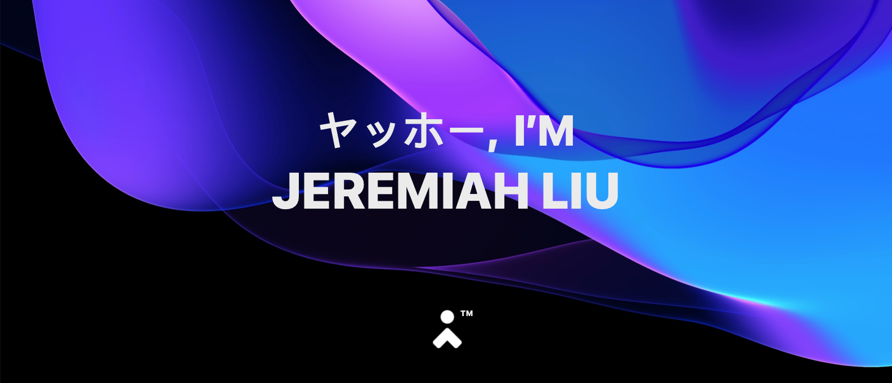

I'm an engineer with the following interests:
- Modern artificial intelligence, exploits computation and data as a lens to explore machine intelligence.
- Full-stack software development as a way of packaging intelligence to deliver service and experience as value created for end users.
- Distributed service architecture that scales to serve more people and create more value.

I spend most of my time coding on exciting projects with &nbsp; &nbsp; &nbsp;. Outside my work, I love creating cool 3D models with &nbsp;  &nbsp; while exploring their potential in AR/VR. I listen to J-Pop and play a guitar.
